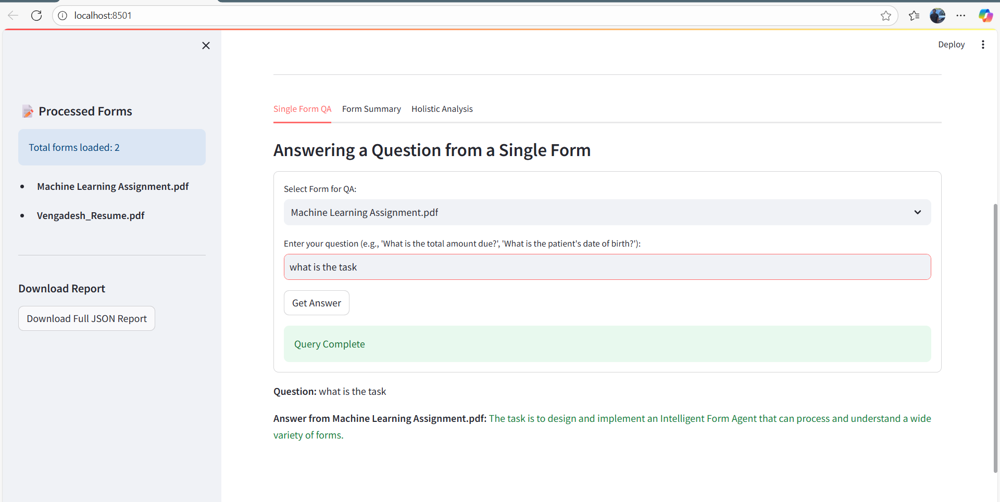
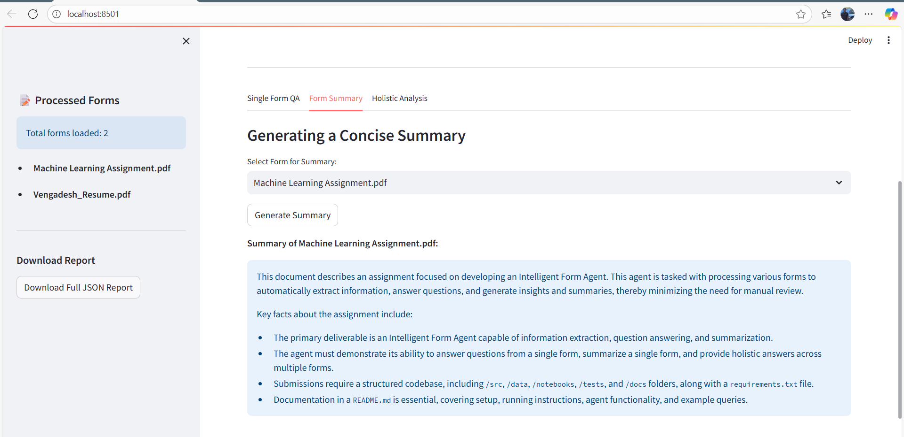
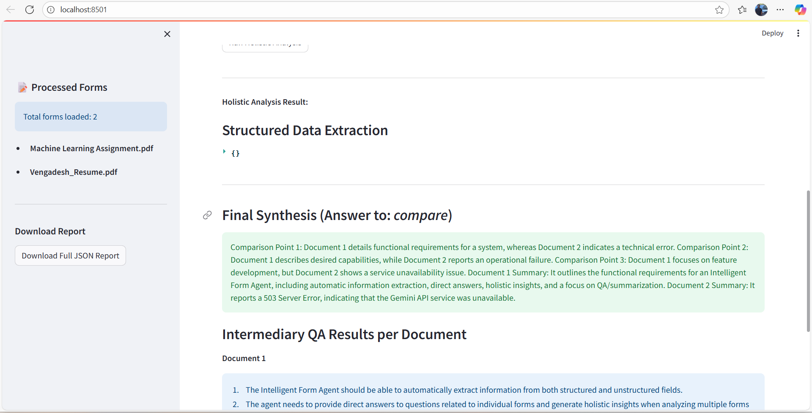

## Intelligent Form Agent
  A Streamlit-based web app for document extraction, question answering (QA), and summarization using Gemini Pro API (or other LLMs via API).
  Supports input from PDF, PNG, JPG, and TXT files.
  Caching is used to speed up repeat queries and minimize API calls.

## Features
 - Upload forms and documents
 - Automatic OCR and text extraction
 - Ask questions about document content
 - Generate informative summaries
 - Holistic analysis across multiple documents
 - Download full extraction/QA/summary report as JSON

## Setup
1. Clone the Repository
    - git clone https://github.com/vengadesh-max/FormsummarizerAgent.git
    - cd intelligent-form-agent
2. Create and Configure .env
    - Add your Gemini Pro API key to .env:
    - Ex : GEMINI_API_KEY=your_api_key_here
3. Install Dependencies
   - pip install -r requirements.txt
4. Run the App
   - streamlit run src/app.py
   - The app will start at http://localhost:8501

## Usage
 - Upload a supported form/document (PDF, PNG, JPG, TXT).
 - Ask questions about the document using the Single Form QA tab.
 - Generate summaries for the document.
 - Perform Holistic Analysis across multiple uploaded files.
 - Download the full processed report as JSON from the sidebar.

## Environment Variables
 - GEMINI_API_KEY: Your Google Gemini Pro API key (required for Gemini API usage)
 - imp : Place these in your .env file at project root.

## Notes
 - The Gemini API is required for best results
 - If you do not have access, fallback to Hugging Face token is possible (accuracy may vary).
 - For Gemini API errors (404), check account/model permissions.

## Troubleshooting
 - API Errors: Check .env is present and credentials are correct.
 - OCR errors: Ensure Tesseract and PIL are installed.
 - Permissions: Gemini API access must be enabled in your Google project.

## Sample outputs
 - Demo video : https://drive.google.com/file/d/1kmRguQp0KOW2nFyXeglGWMR4-4GwLgIz/view?usp=sharing
  ## Q&A 
  
  ## Summarization
  
  ## Holistic insights
  

